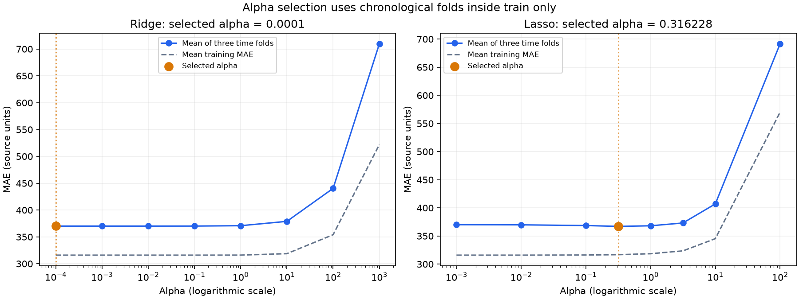

# Ridge and Lasso: alpha selection

## Method

Three expanding chronological folds are created inside the original training split. A three-observation gap prevents thirty-minute-ahead training labels from crossing a fold boundary. The scaler is fitted inside each fold's pipeline. The scorer uses nonnegative predictions and average-zone MAE.
Alpha is selected by minimum mean fold MAE, with two bounded endpoint expansions and a local logarithmic refinement. This identifies the best tested alpha under this protocol, not a universal optimum. Refitted candidates are then compared on the original validation split. The held-out test is not evaluated by this stage.
Lasso keeps tolerance 0.001; its search iteration limit is increased from 3,000 to 200,000 and uses randomized coordinate updates with seed 42 to permit convergence at weak penalties. The small feature Gram matrix is precomputed for efficiency; this does not change the objective. Convergence warnings stop the search rather than silently ranking incomplete fits.

## Actual results

| Model | Alpha | Train MAE | Time-fold MAE | Validation MAE | Validation RMSE |
| --- | ---: | ---: | ---: | ---: | ---: |
| Linear | — | 332.02 | 370.11 | 318.99 | 464.88 |
| Ridge initial | 100 | 355.69 | 440.33 | 351.45 | 504.71 |
| Ridge tuned | 0.0001 | 332.02 | 370.11 | 318.99 | 464.88 |
| Lasso initial | 10 | 356.15 | 407.04 | 338.73 | 492.60 |
| Lasso tuned | 0.316228 | 333.67 | 367.10 | 320.16 | 466.54 |

## Interpretation

The lowest validation MAE among these candidates is obtained by **Linear**.
- Ridge: selected alpha 0.0001; winner remains at the explored boundary; smaller/larger penalties remain untested.
- Lasso: selected alpha 0.316228; winner lies inside the explored range.
- A favorable individual prediction is not evidence of lower average error. Inspect the complete validation comparison.
- Train/fold differences can reflect seasonal change as well as model fit; they do not alone prove overfitting.
- Zero Lasso coefficients do not establish that a weather variable has no real-world effect.
- The reported fold score is used for parameter selection, not an unbiased final test result.

## Reproduce and present

Run `./run_tuning.ps1` to repeat the search. Run `./run_tuning.ps1 -ShowResults` to display saved results immediately.
Detailed evidence: `alpha_search.csv`, `alpha_folds.csv`, `alpha_comparison.csv`, `alpha_real_examples.csv`, and `../artifacts/alpha_tuning_summary.json`.

References: [GridSearchCV](https://scikit-learn.org/stable/modules/generated/sklearn.model_selection.GridSearchCV.html), [TimeSeriesSplit](https://scikit-learn.org/stable/modules/generated/sklearn.model_selection.TimeSeriesSplit.html).