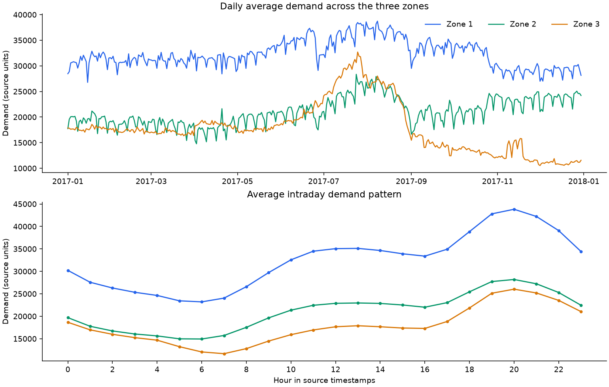
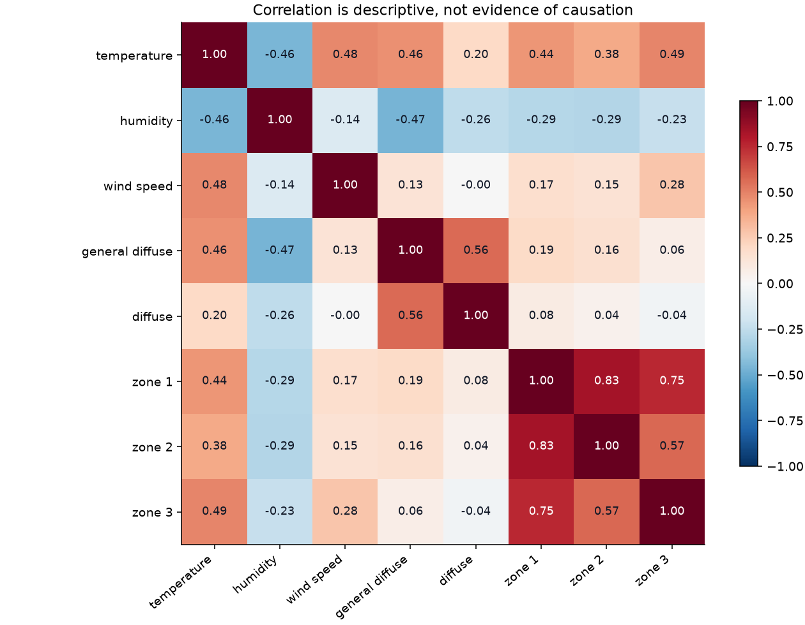

# Tetouan GridWatch — Source Data Audit

## Established facts

- Source CSV: 52,416 observations and 9 columns.
- Observed period: 2017-01-01 00:00:00 to 2017-12-30 23:50:00.
- Missing cells: 0; duplicate timestamps: 0; irregular ten-minute intervals: 0.
- UCI reports 52,417 instances; this file contains 52,416 data rows. The discrepancy is documented rather than adding a fabricated record.
- Input: current and historical weather, current and historical demand, and known calendar information.
- Target: demand at a timestamp exactly 30 minutes after the forecast origin, separately for each zone.
- Original measurement units are not documented in the UCI variables table. Charts retain source units and do not label the targets as kWh.
- Timestamps have no timezone offset in the CSV. Calendar features use the source timestamps unchanged.

## Decisions before modelling

- Use chronological development and held-out evaluation. The split is provisional until coordinated with other groups using this dataset.
- Exclude future measured weather from prediction inputs.
- Define high-demand thresholds using training data only. They are research thresholds, not grid capacity limits.
- Retain high but valid demand values. Peak demand is a target of interest, not automatically an outlier to delete.
- This stage establishes the data and problem. It does not establish forecasting accuracy or a novel method.

## Initial descriptive observations

- Zone-level daily mean ranges: zone_1: 26,772–38,733; zone_2: 14,779–28,355; zone_3: 10,531–32,700.
- The annual and intraday plots will inform feature design. Correlations alone do not establish causal effects of weather.

Source: https://archive.ics.uci.edu/dataset/849/power+consumption+of+tetouan+city

