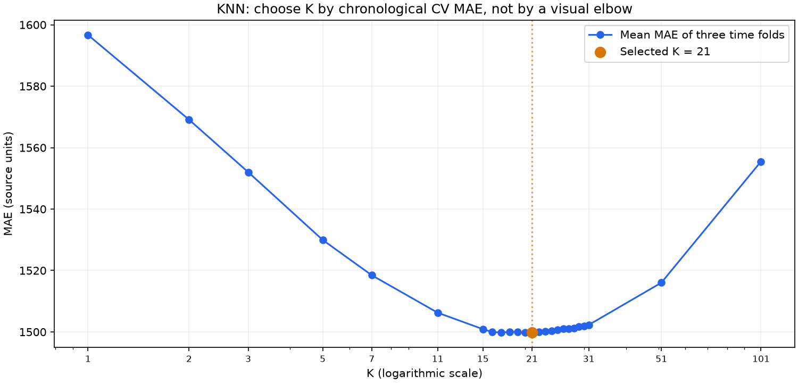

# Phần 3.5 — KNN: chọn K, giải thích dự đoán và MAE

Nhóm 14 — DS66B: Trần Quang Huy, Bùi Ngọc Thuấn, Nguyễn Hoàng Thành.

## 1. Tổng quan: phần này làm gì và vì sao?

Linear học một công thức từ dữ liệu. KNN tìm những mẫu quá khứ giống đầu vào hiện tại, rồi dùng các đáp án của chúng để dự đoán. Chúng ta thử KNN để đối chiếu hai hướng đó trên cùng bài toán dự đoán trước 30 phút.

K là số hàng xóm tham khảo. K nhỏ dễ phụ thuộc vào vài mẫu; K lớn làm dự đoán trung bình trên nhiều hoàn cảnh hơn, nhưng có thể trộn những hoàn cảnh không còn giống nhau. Không có quy tắc “K càng lớn càng tốt”. Tìm K và vẽ đường sai số là cách làm thông thường, không phải tính năng mới của dự án.

Phần đã chạy: giữ nguyên 48 đầu vào, trọng số theo khoảng cách và cách chia thời gian; chỉ chọn K. **K được chọn là 21, tốt nhất trong 25 giá trị đã thử bằng ba lượt kiểm tra theo thời gian trong train.**

## 2. Mở và chạy ở đâu?

Mở thư mục dự án bằng VS Code:

```text
D:\Kỳ I 2026-2027\Học thống kê\Midterm_Tetouan_GridWatch
```

```text
src/gridwatch/knn_tuning.py       Chọn K, so sánh và truy ra hàng xóm thật
src/gridwatch/tuning.py          Dùng lại cách chia thời gian và tính MAE
run_knn.ps1                     Lệnh chạy phần KNN
reports/knn_k_search.csv         Điểm của từng K, gồm cả ba lượt riêng
reports/knn_comparison.csv       MAE validation của Linear, KNN cũ và KNN đã chọn
reports/knn_real_examples.csv    Hai thời điểm thật, ba khu vực, ba mô hình
reports/knn_neighbors_selected.csv  Tất cả 21 hàng xóm của mẫu minh họa
reports/knn_neighbors_initial.csv   15 hàng xóm của cấu hình cũ
reports/figures/knn_k_search.png  Đường MAE theo K
artifacts/knn_tuning_summary.json  Cách chọn K và kết quả kiểm tra phép tính
```

Trong terminal PowerShell:

```powershell
Set-Location -LiteralPath 'D:\Kỳ I 2026-2027\Học thống kê\Midterm_Tetouan_GridWatch'
.\run_knn.ps1 -ShowResults
```

Lệnh này hiển thị kết quả đã lưu, không huấn luyện lại. Để chạy lại thí nghiệm:

```powershell
.\run_knn.ps1
```

Khi chiếu: mở bảng MAE → biểu đồ K → bảng dự đoán thật → bảng hàng xóm → code. Các kết quả nằm riêng để đối chiếu với benchmark ban đầu.

## 3. Tìm K và cách hiểu “Elbow”

Ban đầu thử K = 1, 2, 3, 5, 7, 11, 15, 21, 31, 51, 101. Tìm vùng tốt nhất rồi thử đủ các K nguyên nằm giữa hai giá trị kề nó. Nếu tốt nhất nằm ở mép trên, code cho phép mở rộng hai lần có giới hạn số mẫu train. Các K thực sự đã thử: **1, 2, 3, 5, 7, 11, 15, 16, 17, 18, 19, 20, 21, 22, 23, 24, 25, 26, 27, 28, 29, 30, 31, 51, 101**.

Mỗi K được đánh giá trên ba lượt thời gian bên trong train; scaler học riêng trên phần được phép học của mỗi lượt. Khoảng cách ba mẫu ở ranh giới giữ đáp án 30 phút sau của train trước thời điểm dự đoán trong lượt kiểm tra. Code dùng lại `chronological_folds` đã kiểm tra ở phần alpha.

Chọn K bằng **MAE kiểm tra trung bình thấp nhất**. Biểu đồ là đường sai số theo K; có thể quan sát chỗ uốn, nhưng không chọn bằng cảm giác. Elbow dựa trên độ gọn của cụm trong K-means là bài toán khác. Ở đây có đáp án thật, vì vậy dùng trực tiếp sai số dự đoán.

K = 15 có MAE trung bình các lượt là 1.500,90; K = 21 có MAE 1.499,79. Điểm này dùng để chọn tham số. Nó không phải MAE validation ngoài và không phải điểm test cuối.

Trục ngang biểu đồ dùng thang log để nhìn rõ cả K nhỏ và K lớn; tất cả K được thử đều có điểm trên đường, một số nhãn trục được lược bớt để dễ đọc. Đường xanh là MAE của ba lượt kiểm tra. Chấm cam là giá trị được chọn. Không dùng hình dạng trên thang log để khẳng định có một khuỷu tay toán học duy nhất.



## 4. Code thật: ghép các bước lại

Mở `src/gridwatch/knn_tuning.py`, dùng Ctrl+G tới dòng 24:

```python
def make_knn(k=15):
    return make_pipeline(
        StandardScaler(),
        KNeighborsRegressor(n_neighbors=k, weights="distance", n_jobs=2),
    )

```

`StandardScaler` chuẩn hóa vì các cột có thang số khác nhau. Nó không tự chọn độ quan trọng tối ưu của các đặc trưng. `n_neighbors=k` đưa số K đang thử vào mô hình. `weights="distance"` cho hàng xóm gần ảnh hưởng nhiều hơn. `n_jobs=2` cho hai tác vụ tìm hàng xóm chạy song song.

Tới dòng 39:

```python
search = GridSearchCV(
    make_knn(), param_grid={"kneighborsregressor__n_neighbors": values},
    scoring=SCORER, cv=folds, refit=True, n_jobs=1, error_score="raise",
)
search.fit(X_train, y_train)
```

`kneighborsregressor__n_neighbors` nối tên bước mô hình với tham số cần thử. `cv=folds` dùng đúng ba lượt theo thời gian. `refit=True` học lại cấu hình thắng trên toàn bộ train. `n_jobs=1` cho các thí nghiệm chạy tuần tự; việc tìm hàng xóm bên trong mỗi thí nghiệm vẫn có hai tác vụ. `search.fit` chỉ nhận train, không nhận validation ngoài hoặc test.

Tới dòng 84 để xem cách lấy hàng xóm và trọng số. Hàm gọi `kneighbors` trên dữ liệu đã chuẩn hóa. Với khoảng cách d lớn hơn 0:

```text
trọng số chưa chuẩn hóa = 1 / d
trọng số chuẩn hóa = (1 / d) / tổng(1 / khoảng cách của các hàng xóm)
dự đoán = tổng(trọng số chuẩn hóa × đáp án của hàng xóm)
```

Nếu có hàng xóm trùng chính xác đầu vào, chỉ các hàng xóm có khoảng cách 0 được chia đều trọng số. Code xử lý trường hợp đó giống thư viện.

Sau khi cộng các đóng góp, code dùng `np.testing.assert_allclose` để so với `model.predict`. Lần chạy thật đã đối chiếu thành công cho cả ba khu vực, cả cấu hình cũ và mới. Đây là kiểm tra độc lập phép tính dự đoán; không phải bằng chứng rằng dự đoán luôn chính xác.

## 5. MAE tổng thể của mô hình — kết quả thật

| Mô hình | K | MAE validation |
| --- | ---: | ---: |
| Linear | Không có | 318,99 |
| KNN initial | 15 | 1.698,80 |
| KNN selected | 21 | 1.715,34 |

MAE này tính trên 7.859 thời điểm × 3 khu vực = **23.577 sai số tuyệt đối**:

```text
MAE validation = tổng |số thật − dự đoán| của 23.577 giá trị / 23.577
```

Code tính điểm dùng chung trong `src/gridwatch/tuning.py`:

```python
def forecast_mae(actual, predicted):
    """Use the same nonnegative forecasts as the initial benchmark."""
    return float(mean_absolute_error(actual, np.maximum(predicted, 0)))
```

`mean_absolute_error` tính trung bình sai số tuyệt đối trên các mẫu và các đầu ra. `np.maximum` giữ dự đoán không âm, thống nhất với benchmark. Trong tìm kiếm, `SCORER` dùng dấu âm để thư viện có thể tối đa hóa điểm; báo cáo đổi lại thành MAE dương.

Sau khi chọn K, MAE validation **tăng từ 1.698,80 lên 1.715,34**. Cách nhận xét chính xác: K được chọn tốt hơn trong các lượt dùng để chọn tham số, nhưng kết quả ở giai đoạn phía sau vẫn cần kiểm tra riêng. Linear hiện có MAE validation thấp hơn KNN. Không chỉnh K theo test; lần này không đánh giá lại test.

Không nói KNN đã được tối ưu trên mọi cách xây dựng đặc trưng, khoảng cách hay trọng số: thí nghiệm này chỉ chọn K với các thành phần còn lại được cố định. Kém hơn Linear cũng không chứng minh KNN luôn kém ở mọi bài toán. Muốn kết luận nguyên nhân cụ thể phải có thí nghiệm thêm.

## 6. Một mẫu thật: mô hình trả ra số nào?

Lấy dữ liệu lúc **12/09/2017 19:10**, dự đoán số đo lúc **19:40**. Nhiệt độ lúc dự đoán là 23,25; độ ẩm 51,38; điện khu vực 1 hiện tại là 47.322,47788. Các lịch sử và lịch thời gian đưa đầu vào thành 48 cột. Chỉ dùng thông tin đã có lúc 19:10.

| Mô hình | Khu vực | Số thật lúc 19:40 | Dự đoán | Sai số tuyệt đối |
| --- | --- | ---: | ---: | ---: |
| Linear | zone_1 | 47.679,29 | 47.304,42 | 374,87 |
| Linear | zone_2 | 28.444,49 | 28.391,77 | 52,72 |
| Linear | zone_3 | 21.763,27 | 21.833,31 | 70,04 |
| KNN initial | zone_1 | 47.679,29 | 46.110,20 | 1.569,09 |
| KNN initial | zone_2 | 28.444,49 | 27.422,75 | 1.021,74 |
| KNN initial | zone_3 | 21.763,27 | 22.946,04 | 1.182,77 |
| KNN selected | zone_1 | 47.679,29 | 45.852,60 | 1.826,69 |
| KNN selected | zone_2 | 28.444,49 | 27.315,25 | 1.129,24 |
| KNN selected | zone_3 | 21.763,27 | 23.229,43 | 1.466,16 |

Riêng khu vực 1, KNN đã chọn trả ra **45.852,60**, so với thực tế **47.679,29**:

```text
sai số tuyệt đối = abs(47679.29204 − 45852.60021)
                 ≈ 1.826,69
```

Đây là sai số của **một dự đoán**, không gọi nó là MAE toàn bộ mô hình. Nếu lấy trung bình ba khu vực tại riêng thời điểm này, ta có:

```text
MAE của ba khu vực tại một thời điểm
= (1.826,69 + 1.129,24 + 1.466,16) / 3
≈ 1.474,03
```

Con số này cũng khác MAE validation tổng thể. Phải nói rõ tập giá trị đang lấy trung bình để tránh nhầm.

## 7. KNN đã lấy những hàng nào?

Bảng dưới là ba hàng đầu trong 21 hàng xóm thật của cấu hình đã chọn:

| Hạng | Dòng trong CSV gốc | Thời điểm hàng xóm | Khoảng cách | Trọng số | Đáp án khu vực 1 sau 30 phút | Đóng góp vào dự đoán |
| --- | ---: | --- | ---: | ---: | ---: | ---: |
| 1 | 36549 | 2017-09-11 19:10:00 | 1,9943 | 7,872% | 46.704,42 | 3.676,37 |
| 2 | 36550 | 2017-09-11 19:20:00 | 2,6069 | 6,022% | 46.596,11 | 2.806,01 |
| 3 | 35974 | 2017-09-07 19:20:00 | 2,8061 | 5,594% | 46.946,55 | 2.626,41 |

Thời điểm hàng xóm là thời điểm quan sát đầu vào. Đáp án của nó nằm sau thời điểm đó 30 phút. Ví dụ hàng đầu được đưa vào KNN với thông tin lúc 2017-09-11 19:10:00, còn đáp án được tra ở 2017-09-11 19:40:00.

Trọng số hàng đầu là 7,872%; đáp án là 46.704,42, nên đóng góp là khoảng 3.676,37. Cộng **đủ 21 đóng góp**, không chỉ ba hàng đang minh họa, thu được 45.852,60. Bảng đầy đủ có trong `knn_neighbors_selected.csv`. Trọng số cộng bằng 1.

Khoảng cách được tính trên 48 cột đã chuẩn hóa. Hai cột nhiệt độ/độ ẩm được xuất thêm để dễ nhìn, nhưng không phải toàn bộ thông tin dùng để xếp hạng. Dòng trong CSV bắt đầu đếm từ 1 và có tính dòng tiêu đề; bảng đã xuất số dòng gốc để mở ra đối chiếu.

## 8. Lời báo cáo trước lớp

“Nhóm em bổ sung KNN để kiểm tra hướng dự đoán từ những tình huống quá khứ tương tự. Đây là biểu đồ sai số khi thay đổi K. Nhóm chọn K bằng ba lượt kiểm tra theo thời gian trong train, rồi đánh giá trên validation phía sau. K được chọn là 21. Đây là ví dụ lúc 19:10 dự đoán trước 30 phút: mô hình trả ra 45.852,60, còn thực tế là 47.679,29, sai số là 1.826,69. Các hàng xóm thật và đóng góp của chúng được lưu tại đây. MAE trên toàn bộ validation là 1.715,34, nên ở thí nghiệm hiện tại nhóm vẫn chọn Linear với MAE 318,99.”

Nếu thầy hỏi vì sao chọn K xong chưa chắc tốt hơn: “Giá trị được chọn tốt nhất trong ba lượt thời gian dùng để tìm tham số. Giai đoạn validation nằm phía sau là một phép kiểm tra khác; nhóm báo cáo cả hai kết quả, không hứa tối ưu tham số sẽ luôn cải thiện.”

## 9. Kiểm chứng và nguồn

Bảy kiểm tra tự động hiện có của dự án đã đạt trong quá trình làm phần này. Mỗi lần chạy phần KNN kiểm tra thêm việc cộng trọng số hàng xóm có tái tạo được dự đoán của thư viện. Kết quả MAE của KNN K=15 tái hiện benchmark ban đầu; điểm được chọn là nhỏ nhất trong bảng các K đã thử.

Nguồn: [KNeighborsRegressor](https://scikit-learn.org/stable/modules/generated/sklearn.neighbors.KNeighborsRegressor.html), [GridSearchCV](https://scikit-learn.org/stable/modules/generated/sklearn.model_selection.GridSearchCV.html), [TimeSeriesSplit](https://scikit-learn.org/stable/modules/generated/sklearn.model_selection.TimeSeriesSplit.html).
