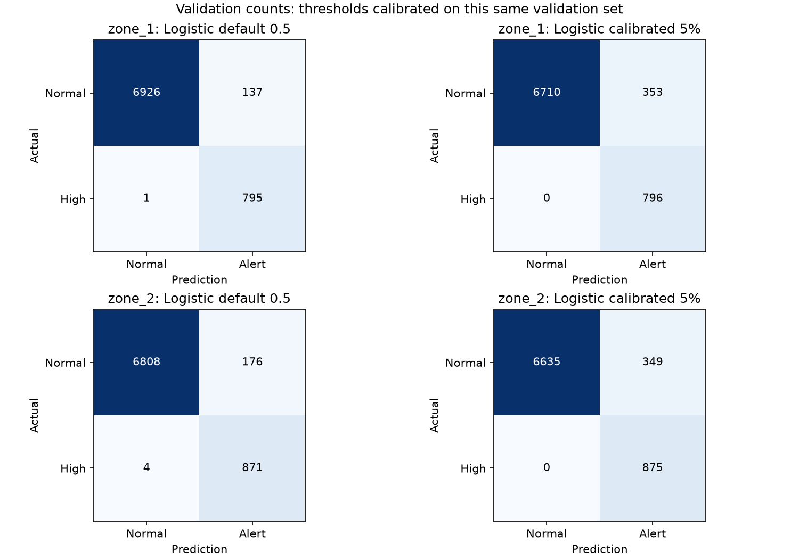

# Phần 4.1 — Logistic Regression: cảnh báo nhu cầu điện cao

Nhóm 14 — DS66B: Trần Quang Huy, Bùi Ngọc Thuấn, Nguyễn Hoàng Thành.

## 1. Tổng quan: chúng ta đang thêm việc gì?

Phần hồi quy dự đoán một con số điện trước 30 phút. Phần này dự đoán một nhãn: **0 = dưới ngưỡng điện cao; 1 = từ ngưỡng điện cao trở lên**. Mỗi khu vực có một Logistic Regression riêng. Chúng dùng cùng 48 đầu vào đã chuẩn bị, gồm dữ liệu hiện tại, lịch sử và lịch thời gian.

Mục đích là kiểm tra việc học trực tiếp nhãn cao/thấp có giúp cảnh báo tốt hơn lấy số dự đoán của Linear rồi đặt ngưỡng không. Đây là phương pháp classification thông thường. Lợi ích của thành phần cảnh báo riêng là giả thuyết cần kiểm chứng; kết quả hiện tại chưa cho thấy ưu thế lớn.

## 2. Mở và chạy ở đâu?

Mở bằng VS Code:

```text
D:\Kỳ I 2026-2027\Học thống kê\Midterm_Tetouan_GridWatch
```

```text
src/gridwatch/logistic_alerts.py    Chạy phần cảnh báo và xuất bằng chứng
src/gridwatch/experiment.py        Khai báo Logistic, tính điểm và chọn ngưỡng dùng chung
run_logistic.ps1                   Lệnh chạy
reports/logistic_label_counts.csv  Ngưỡng điện và số nhãn của từng khu vực
reports/logistic_alert_metrics.csv Báo đúng, báo nhầm, bỏ sót, các tỷ lệ
reports/logistic_real_examples.csv Các ví dụ thực tế, có ghi cách chọn ví dụ
reports/logistic_contributions.csv 48 đóng góp tạo ra điểm Logistic cho mẫu đầu
reports/logistic_threshold_curve.csv Thử các mức báo nhầm 0%, 1%, 2%, 5%, 10%
reports/figures/logistic_confusion.png  Ma trận dự đoán và thực tế
artifacts/logistic_alert_summary.json  Cấu hình và giới hạn đánh giá
```

Trong terminal PowerShell ở thư mục dự án:

```powershell
.\run_logistic.ps1 -ShowResults
```

Lệnh này đọc kết quả đã lưu. Để chạy lại mô hình và xuất lại kết quả:

```powershell
.\run_logistic.ps1
```

Khi chiếu: bảng ngưỡng điện → ví dụ nhãn → đoạn code → ma trận sai số → bảng so sánh với Linear. Không cần huấn luyện lại giữa buổi trình bày nếu chỉ muốn giải thích kết quả đã có.

## 3. Hai ngưỡng khác nhau

**Ngưỡng điện cao** có đơn vị theo dữ liệu gốc, dùng để xác định đáp án. Chọn phân vị 90% chỉ trong train: khoảng 10% mẫu train thuộc lớp điện cao. Nhóm không có nhãn quá tải hay sự cố, nên không gọi nhãn này là nguy cơ mất điện đã được xác nhận.

| Khu vực | Ngưỡng điện cao | Nhãn 1 trong train | Nhãn 1 trong validation |
| --- | ---: | ---: | ---: |
| 1 | 43.101,95745 | 3.569 / 35.680 | 796 / 7.859 |
| 2 | 27.262,02532 | 3.569 / 35.680 | 875 / 7.859 |
| 3 | 28.402,34310 | 3.570 / 35.680 | 0 / 7.859 |

Tỷ lệ validation không bắt buộc đúng 10%: ngưỡng đã cố định từ train, giai đoạn sau có thể có phân phối khác. Số mẫu train không đúng 10% tuyệt đối còn do giá trị trùng nhau tại ngưỡng và quy tắc `>=`.

**Ngưỡng điểm Logistic** nằm trong khoảng 0–1, dùng để ra quyết định từ đầu ra mô hình. Ngưỡng mặc định là 0,5. Thí nghiệm thêm một ngưỡng được chọn để tỷ lệ báo nhầm trong các thời điểm bình thường của validation không vượt 5%.

Hai ngưỡng không có cùng ý nghĩa: 43.101,96 quyết định số điện thật có thuộc lớp cao; 0,017838 ở khu vực 1 quyết định khi nào điểm Logistic đủ lớn để báo động.

## 4. Tạo nhãn: code và dòng dữ liệu thật

Trong `src/gridwatch/logistic_alerts.py`, dòng 91:

```python
high_thresholds = train_demand.quantile(config["high_demand_training_quantile"])
train_labels = (train_demand >= high_thresholds).astype(int)
validation_labels = (validation_demand >= high_thresholds).astype(int)
```

`train_demand` là đáp án sau 30 phút của các mẫu được phép học. `.quantile(.9)` lấy ngưỡng từ train. `astype(int)` đổi đúng/sai thành 1/0. Validation dùng lại chính ngưỡng train, không tự tính ngưỡng mới để làm kết quả đẹp hơn.

Hai dòng thật của khu vực 1:

| Thời điểm dùng thông tin | Đáp án lúc | Số điện thật | So với 43.101,95745 | Nhãn |
| --- | --- | ---: | --- | ---: |
| 12/09/2017 19:10 | 19:40 | 47.679,29204 | Cao hơn | 1 |
| 12/09/2017 21:40 | 22:10 | 42.620,17699 | Thấp hơn | 0 |

Nhãn dùng để học là số điện ở tương lai; đầu vào mô hình vẫn chỉ là những thông tin đã quan sát được lúc dự đoán. Biết đáp án khi học từ dữ liệu lịch sử không có nghĩa đưa đáp án tương lai vào đầu vào khi dự đoán.

## 5. Logistic học và tạo điểm như thế nào?

Khai báo thật ở `src/gridwatch/experiment.py`, dòng 41:

```python
"Logistic": make_pipeline(
    StandardScaler(),
    LogisticRegression(class_weight="balanced", max_iter=1500, C=1)
),
```

StandardScaler học trung bình và độ lệch chuẩn trên train rồi chuẩn hóa các cột. Logistic ghép các cột đã chuẩn hóa thành một điểm tuyến tính, rồi đưa qua hàm sigmoid để có đầu ra 0–1.

```text
điểm tuyến tính = hệ số chặn + tổng(hệ số từng cột × đầu vào đã chuẩn hóa)
điểm Logistic = 1 / (1 + exp(−điểm tuyến tính))
```

`class_weight="balanced"` tăng trọng số cho lớp ít xuất hiện khi học. Khu vực 1 có 3.569 mẫu cao và 32.111 mẫu bình thường: trọng số lớp cao khoảng 5,00, bình thường khoảng 0,556. Đây là trọng số trong hàm mất mát, không phải tự tạo thêm dữ liệu.

`max_iter=1500` là giới hạn số bước giải; các lần chạy thực tế hội tụ sau 123, 107, 89 bước cho ba khu vực. Code dừng nếu bộ giải chưa hội tụ. `C=1` là cấu hình hiện có; C nhỏ phạt hệ số mạnh hơn. Chưa tìm C trong phần này. Logistic học bằng mất mát phân loại, không dùng MAE hồi quy để học nhãn.

Đầu ra `predict_proba` là điểm xác suất của mô hình. Chúng ta chưa kiểm tra hiệu chỉnh xác suất, đặc biệt khi đã dùng trọng số lớp, nên không diễn giải 0,70 thành “chắc chắn có 70% nguy cơ thật”. Dùng điểm này để xếp hạng và đặt ngưỡng trong thí nghiệm.

## 6. Giải thích điểm bằng số thật

Mẫu khu vực 1 lúc 19:10 có nhiệt độ 23,25:

```text
chuẩn hóa nhiệt độ = (23,25 − 19,462273) / 6,093822 ≈ 0,621568
hệ số Logistic của cột này ≈ 0,252520
đóng góp vào điểm tuyến tính ≈ 0,156958
```

Cột điện khu vực 1 hiện tại có giá trị 47.322,47788, sau chuẩn hóa khoảng 1,971910; hệ số khoảng 10,327848; đóng góp khoảng 20,365588.

Cộng đủ 48 đóng góp và hệ số chặn −22,335203 cho điểm tuyến tính **12,291297**. Sigmoid của nó là **0,9999954085**. Code đã kiểm tra phép tính này khớp `predict_proba`. Bảng đủ 48 cột nằm trong `logistic_contributions.csv`.

Một đóng góp dương làm tăng điểm trong công thức đã học, nhưng không chứng minh biến đó là nguyên nhân vật lý gây tăng điện. Mô hình còn dùng nhiều biến có tương quan với nhau.

## 7. Chọn ngưỡng báo động: vì sao có dòng code hơi đặc biệt?

Ngưỡng trong `logistic_alerts.py` được gọi ở dòng 115:

```python
score_cutoff = fit_operating_threshold(scores, truth_validation, FALSE_ALARM_BUDGET)
logistic_decision = (scores >= score_cutoff).astype(int)
```

Trong `experiment.py`, hàm dùng chung tính:

```python
negatives = np.asarray(scores)[np.asarray(truth) == 0]
threshold = float(np.nextafter(
    np.quantile(negatives, 1 - false_alarm_budget, method="higher"), np.inf
))
```

`negatives` là điểm của những mẫu thật sự bình thường. Phân vị 95% lấy một mốc gần phía cao của nhóm này. `method="higher"` chọn giá trị quan sát phía trên. `np.nextafter(..., np.inf)` nhích ngưỡng lên một lượng nhỏ nhất mà máy tính biểu diễn được, để những điểm trùng đúng ngưỡng không cùng bị báo động khi dùng `>=`. Đây là xử lý số và điểm trùng, không phải thay đổi nhãn.

5% là mức giới hạn nghiên cứu đã đặt trước, không phải quy định vận hành của công ty điện lực. Hàm tìm ngưỡng nhằm phát hiện nhiều hơn trong giới hạn đó; nó không tối ưu chi phí báo nhầm/bỏ sót đã được thực tế xác nhận. Giới hạn 5% cũng không có nghĩa cần dùng hết 5%: bảng dưới cho thấy ngưỡng 0,5 có thể là một lựa chọn đáng cân nhắc.

Ngưỡng Logistic được tính: khu vực 1 = **0,0178382544**; khu vực 2 = **0,1840674967**. Ngưỡng khác nhau vì phân phối điểm của hai mô hình khác nhau.

## 8. Đầu ra thật, gồm cả một báo động nhầm

| Mẫu khu vực 1 | Điểm Logistic | Ngưỡng | Quyết định | Nhãn thật |
| --- | ---: | ---: | --- | ---: |
| 12/09 19:10 → 19:40 | 0,9999954085 | 0,0178382544 | Báo động | 1 — báo đúng |
| 12/09 21:40 → 22:10 | 0,7003111154 | 0,0178382544 | Báo động | 0 — báo nhầm |

Dòng thứ hai cho thấy mô hình có thể tự tin nhưng sai: số thật lúc 22:10 là 42.620,17699, thấp hơn ngưỡng điện cao. Hai ví dụ này được chọn theo quy tắc: thời điểm đầu tiên và báo nhầm đầu tiên theo thứ tự thời gian, không chọn dự đoán đẹp tùy ý. File còn có mẫu bình thường đầu tiên và mẫu bị ngưỡng 0,5 bỏ sót đầu tiên.

## 9. Chấm cảnh báo bằng gì? Không dùng MAE thay cho tất cả

| Kết quả | Ý nghĩa |
| --- | --- |
| TP | Điện thật cao và mô hình báo động |
| FP | Điện thật bình thường nhưng mô hình báo động |
| FN | Điện thật cao nhưng mô hình không báo |
| TN | Điện thật bình thường và mô hình không báo |

Recall = TP / (TP + FN): phát hiện bao nhiêu trong số các mẫu cao thật.

Precision = TP / (TP + FP): bao nhiêu trong các lần báo động là đúng.

FPR = FP / (FP + TN): bao nhiêu thời điểm bình thường bị báo nhầm. **Mẫu số không phải toàn bộ thời điểm và không phải số lần báo động.**

Các mẫu cách nhau 10 phút; nhiều nhãn cao liên tiếp có thể thuộc cùng một đợt điện cao. Các số TP/FP dưới đây đếm thời điểm, không phải số đợt độc lập.

| Khu vực | Quy tắc Logistic | TP | FP | FN | TN | Recall | Precision | FPR |
| --- | --- | ---: | ---: | ---: | ---: | ---: | ---: | ---: |
| 1 | Điểm ≥ 0,5 | 795 | 137 | 1 | 6.926 | 99,87% | 85,30% | 1,94% |
| 1 | Ngưỡng hiệu chỉnh 5% | 796 | 353 | 0 | 6.710 | 100% | 69,28% | 5,00% |
| 2 | Điểm ≥ 0,5 | 871 | 176 | 4 | 6.808 | 99,54% | 83,19% | 2,52% |
| 2 | Ngưỡng hiệu chỉnh 5% | 875 | 349 | 0 | 6.635 | 100% | 71,49% | 5,00% |

Khu vực 1 tại ngưỡng 5%:

```text
Recall = 796 / (796 + 0) = 100%
Precision = 796 / (796 + 353) ≈ 69,28%
FPR = 353 / (353 + 6710) ≈ 4,9979%
```

So với 0,5, ngưỡng 5% phát hiện thêm một mẫu cao nhưng tăng 216 báo nhầm. Khu vực 2 phát hiện thêm bốn mẫu cao, tăng 173 báo nhầm. Không kết luận ngưỡng 5% luôn tốt hơn chỉ vì Recall bằng 100%.



## 10. Đối chiếu công bằng với Linear

Linear tạo số điện dự đoán, rồi có hai cách đặt ngưỡng:

- So trực tiếp với ngưỡng điện cao được học từ train.
- Đặt ngưỡng trên điểm dự đoán để có cùng mức báo nhầm 5% trên validation.

| Khu vực | Cách cảnh báo | TP | FP | FN |
| --- | --- | ---: | ---: | ---: |
| 1 | Linear so với ngưỡng điện cao | 753 | 15 | 43 |
| 1 | Linear cùng mức báo nhầm 5% | 796 | 353 | 0 |
| 1 | Logistic cùng mức báo nhầm 5% | 796 | 353 | 0 |
| 2 | Linear so với ngưỡng điện cao | 830 | 31 | 45 |
| 2 | Linear cùng mức báo nhầm 5% | 874 | 349 | 1 |
| 2 | Logistic cùng mức báo nhầm 5% | 875 | 349 | 0 |

Ngưỡng điểm Linear khi hiệu chỉnh 5% là 40.090,28 và 26.081,77. Chúng thấp hơn ngưỡng điện cao 43.101,96 và 27.262,03: hệ thống có thể báo sớm khi dự đoán chưa vượt ngưỡng nhãn, nhằm giảm bỏ sót.

Nếu chỉ so Logistic 5% với Linear dùng ngưỡng điện cao, ta dễ tuyên bố Logistic tốt hơn trong khi đã cho phép nó báo nhầm nhiều hơn. Khi đối chiếu cùng mức báo nhầm, khu vực 1 có số đếm giống nhau; khu vực 2 Logistic chỉ phát hiện thêm một mẫu. Chưa có bằng chứng về cải thiện lớn hoặc ổn định qua thời gian.

## 11. Những điều phải nói đúng khi báo cáo

Ngưỡng báo động được chọn trên validation, và bảng số đếm cũng được tính trên chính validation. Đây là **kết quả phát triển/hiệu chỉnh**, không phải phép đánh giá độc lập cuối cùng. FPR gần 5% trên bảng là kết quả của cách chọn ngưỡng; không được quảng cáo nó là bảo đảm FPR tương lai. Muốn kiểm tra độc lập cần một giai đoạn sau khi đã cố định ngưỡng. Lần này không đánh giá lại test; dự án đã có một lần benchmark test trước đó.

Khu vực 3 không có mẫu cao trong validation. Recall không xác định vì mẫu số TP + FN bằng 0. Không ghi Recall = 100% hoặc “cảnh báo hoàn hảo”. Nếu cố dùng ngưỡng 5% cho khu vực 3, ta chỉ tạo 392 báo nhầm và vẫn không kiểm chứng được khả năng phát hiện. Kết quả này chỉ là chẩn đoán; dự án giữ trạng thái chưa được xác thực và phương án tạm không cảnh báo cho khu vực này. Không tự hạ ngưỡng điện cao sau khi nhìn validation để tạo sự kiện cho báo cáo.

## 12. Lời trình bày ngắn

“Nhóm em bổ sung bài toán phân loại: dự đoán sau 30 phút có đạt mức điện cao hay không. Nhãn cao được định nghĩa từ phân vị 90% chỉ trong train. Đây là một mẫu thật và cách tạo nhãn. Logistic tạo điểm 0–1, sau đó nhóm thử ngưỡng mặc định và ngưỡng theo mức báo nhầm 5%. Với khu vực 1, ngưỡng 5% phát hiện 796 thời điểm cao nhưng báo nhầm 353 thời điểm. Nhóm đối chiếu Linear ở cùng mức báo nhầm và thấy kết quả ngang nhau ở khu vực 1, chỉ khác một mẫu ở khu vực 2. Vì vậy nhóm chưa tuyên bố mô hình cảnh báo riêng vượt trội. Các số này là kết quả hiệu chỉnh trên validation; khu vực 3 chưa đánh giá được vì không có mẫu cao.”

Đã đối chiếu kết quả với benchmark cũ, kiểm tra các công thức số đếm, nhãn với CSV gốc và tổng 48 đóng góp với đầu ra mô hình. Đã chạy lại 11 kiểm tra tự động hiện có của dự án; tất cả đều đạt.

Nguồn: [LogisticRegression](https://scikit-learn.org/stable/modules/generated/sklearn.linear_model.LogisticRegression.html), [hiệu chỉnh xác suất](https://scikit-learn.org/stable/modules/calibration.html).
